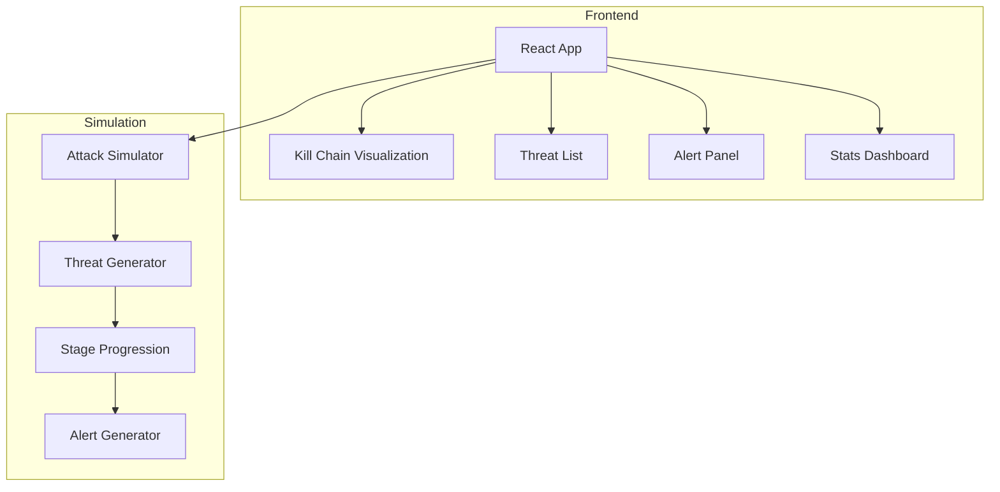

# Cyber Kill Chain Tracker

Visual dashboard mapping detected threats to the Lockheed Martin Cyber Kill Chain framework. Real-time attack simulation and threat progression visualization.


## Live Demo

**[View Live Demo](https://ryanwelchtech.github.io/cyber-kill-chain-tracker)**

## Features

- **Interactive Kill Chain Stages**: Visualize all 7 stages of the Lockheed Martin Cyber Kill Chain
- **Real-time Attack Simulation**: Watch threats progress through the kill chain in real-time
- **Threat Tracking**: Monitor active, contained, and remediated threats
- **Alert Management**: View and acknowledge security alerts with severity levels
- **Mitigation Recommendations**: Get stage-specific defensive measures
- **Modern Defense UI**: Dark theme with cyber aesthetic

## Kill Chain Stages

1. **Reconnaissance** - Target identification and information gathering
2. **Weaponization** - Malware creation and payload development
3. **Delivery** - Transmission of weapon to target
4. **Exploitation** - Vulnerability exploitation
5. **Installation** - Backdoor installation for persistence
6. **Command & Control** - Remote manipulation channel
7. **Actions on Objectives** - Mission execution

## Architecture



## Tech Stack

| Technology | Purpose |
|------------|---------|
| React 18 | UI Framework |
| TypeScript | Type Safety |
| Tailwind CSS | Styling |
| D3.js | Data Visualization |
| Lucide React | Icons |

## Quick Start

```bash
# Install dependencies
npm install

# Start development server
npm start

# Build for production
npm run build

# Deploy to GitHub Pages
npm run deploy
```

## Project Structure

```
cyber-kill-chain-tracker/
├── src/
│   ├── components/
│   │   ├── Header.tsx
│   │   ├── StatsPanel.tsx
│   │   ├── KillChainVisualization.tsx
│   │   ├── ThreatList.tsx
│   │   ├── AlertsPanel.tsx
│   │   ├── StageDetails.tsx
│   │   └── SimulationControls.tsx
│   ├── data/
│   │   ├── killChainStages.ts
│   │   └── mockThreats.ts
│   ├── types/
│   │   └── index.ts
│   ├── App.tsx
│   └── index.tsx
├── public/
└── package.json
```

## Security Concepts Demonstrated

- Threat intelligence visualization
- Kill chain-based defense strategy
- Real-time security monitoring
- Incident response workflows
- Defense-in-depth approach

## Author

**Ryan Welch** - Cloud & Systems Security Engineer

## License

MIT License
